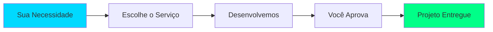

<div align="center">

#  VarejoCode

### Desenvolvimento sob demanda, sem contratos abusivos

[](https://varejocode.com.br)
[](https://github.com/VarejoCode)
[]()


</div>

---

## 📋 Sobre o Projeto

> **Desenvolvimento de software descomplicado, transparente e sob demanda**

VarejoCode é uma plataforma inovadora que revoluciona a forma como empresas contratam serviços de desenvolvimento. Oferecemos soluções tecnológicas personalizadas sem a burocracia e os contratos abusivos do mercado tradicional.

### 💡 O Diferencial



---

## 🎯 Por que escolher VarejoCode?

<table>
<tr>
<td width="33%" align="center">

### 🎨 Flexibilidade Total
Sem contratos rígidos ou multas rescisórias. Você paga apenas pelo que precisa, quando precisa.

</td>
<td width="33%" align="center">

### ⚡ Agilidade
Desenvolvimento rápido e iterativo. Entregas em sprints curtos para você ver resultados rapidamente.

</td>
<td width="33%" align="center">

### 💰 Preços Justos
Precificação transparente por serviço. Sem surpresas no final do mês.

</td>
</tr>
</table>

---

## 🛠️ Como Funciona

### 1️⃣ Escolha o Serviço
Navegue pelos nossos serviços e escolha o que melhor atende sua necessidade:
- Site/Landing Page
- Sistema Web
- App Mobile
- API/Backend
- Consultoria

### 2️⃣ Pagamento Facilitado
Opções flexíveis de pagamento:
- Cartão de crédito
- PIX
- Parcelamento disponível

### 3️⃣ Desenvolvimento
Processo ágil e transparente:
- Sprint semanal com entregas incrementais
- Updates constantes sobre o progresso
- Comunicação direta com a equipe

### 4️⃣ Entrega e Suporte
Garantia de qualidade:
- Revisões ilimitadas durante o desenvolvimento
- 30 dias de garantia pós-entrega
- Documentação completa do projeto

---

## 💼 Serviços Oferecidos

<div align="center">

| Serviço | Descrição | Prazo Médio |
|:-------:|:----------|:-----------:|
| 🌐 **Sites/Landing Pages** | Sites institucionais, landing pages, portfolios | 7-14 dias |
| 💻 **Sistemas Web** | Plataformas complexas, dashboards, ERPs | 30-60 dias |
| 📱 **Apps Mobile** | Aplicativos iOS e Android nativos ou híbridos | 45-90 dias |
| 🔌 **APIs/Backend** | Desenvolvimento de APIs RESTful, microsserviços | 14-30 dias |
| 🎨 **UI/UX Design** | Interfaces modernas, protótipos, design systems | 7-21 dias |
| 🔧 **Manutenção** | Suporte contínuo, correções, melhorias | Sob demanda |
| 👨‍💻 **Consultoria** | Arquitetura, code review, otimização | Por hora |

</div>

---

## 🏆 Modelos de Contratação

### 📦 Hospedado (Mais Popular)
```
✓ Pague apenas pelo que usar
✓ 70% mais barato que o mercado tradicional
✓ Hospedagem garantida e suporte continuo
✓ Manutenções gratuitas
✓ Ideal para projetos emergentes e pontuais
🔴 Sem acesso ao codigo fonte 
```

### 📦 Plano Source 
```
✓ Código-fonte 100% seu
✓ 70% mais barato que o mercado tradicional
✓ Controle completo do projeto
✓ Ideal para quem quer controle total
✓ Documentação técnica completa
```

### 🤝 Dedicação Exclusiva
```
✓ Desenvolvedores dedicados
✓ Integração com sua equipe
✓ Gestão compartilhada
✓ Ideal para grandes projetos
```

---

## 🎨 Tecnologias

<div align="center">

### Frontend


### Backend


### Mobile


</div>

---

## 📊 Nossos Números

<div align="center">

| Métrica | Valor |
|:--------|:------|
| 🎯 **Projetos Entregues** | 150+ |
| ⭐ **Clientes Satisfeitos** | 80+ |
| ⚡ **Taxa de Aprovação** | 98% |
| 🔄 **Tempo Médio de Resposta** | 2h |

</div>

---

## 💬 O que nossos clientes dizem

<div align="center">

> ⭐⭐⭐⭐⭐
> 
> *"A VarejoCode transformou nossa ideia em realidade. O modelo sob demanda foi perfeito para nossa startup!"*
> 
> **— João Silva**

---

> ⭐⭐⭐⭐⭐
> 
> *"Preço justo, qualidade excepcional e sem burocracias. Exatamente o que precisávamos!"*
> 
> **— Maria Santos, Gerente de TI**

---

> ⭐⭐⭐⭐⭐
> 
> *"Equipe altamente qualificada. Entregaram nosso app mobile antes do prazo!"*
> 
> **— Pedro Costa, Fundador da AppIdeas**

</div>

---

## 🚀 Comece Agora

<div align="center">

### Pronto para desenvolver sem burocracias?

[](https://varejocode.com.br/iniciar)
[](https://varejocode.com.br/servicos)
[](https://discord.com/invite/CWEDfvTR5J)

</div>

---

## 📞 Contato

<div align="center">

**🌐 Website:** [varejocode.com.br](https://varejocode.com.br)

**📧 Email:** contato@varejocode.com

**💬 Discord:** [Entre na nossa comunidade](https://discord.com/invite/CWEDfvTR5J)

</div>

---

## 📄 Licença e Termos

Este repositório e seu conteúdo são propriedade da VarejoCode. Para informações sobre licenciamento de projetos desenvolvidos, consulte nossos [Termos de Serviço](https://varejocode.com.br/termos).

---

<div align="center">

### ⚡ VarejoCode - Desenvolvimento descomplicado

**Feito com 💙 por desenvolvedores para desenvolvedores**

[](https://github.com/VarejoCode/VarejoCode)
[](https://github.com/VarejoCode)

</div>
